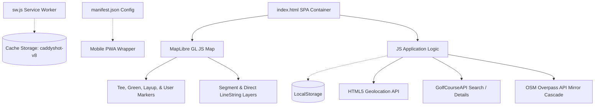

# AI Context: CaddyShot (Golf Shot Tracker) Codebase Summary

This document serves as a high-fidelity reference map of the **CaddyShot** codebase (located in the `golf-shot-tracker` workspace). It outlines the architecture, data schemas, search pipelines, external API integrations, and core mathematical/geodesic logic.

> [!NOTE]
> **Workspace Context**: This workspace contains the **CaddyShot** (Golf GPS Shot Tracker) application. The sibling project **Colin's Charts** (macro/calorie tracker) is located in the adjacent `colins-charts-macros` directory and has its own `AI_CONTEXT.md` mapping out its specific Algolia pipelines and TDEE calculations.

---

## 🏗️ 1. Project Architecture

CaddyShot is a single-page Progressive Web App (PWA) built using vanilla HTML5, Tailwind CSS (via CDN), and JavaScript. It runs entirely client-side, requiring no build tools, bundlers, or server-side preprocessors.



### Core Components Matrix

| File / Directory | Scope / Purpose |
| :--- | :--- |
| [index.html](file:///C:/Users/Colin's%20PC/.gemini/antigravity/scratch/golf-shot-tracker/index.html) | Main UI container and entire JavaScript application logic (state, event handlers, map interactions, modal menus, and geolocation). |
| [manifest.json](file:///C:/Users/Colin's%20PC/.gemini/antigravity/scratch/golf-shot-tracker/manifest.json) | Web App Manifest defining metadata, standalone display mode, orientation lock, and home-screen icons. |
| [sw.js](file:///C:/Users/Colin's%20PC/.gemini/antigravity/scratch/golf-shot-tracker/sw.js) | Service worker utilizing a Cache-First strategy with network fallbacks. Caches third-party scripts (Tailwind, MapLibre, Google Fonts) and local files. |
| `.agents/` | Configuration directory containing workspace-specific assistant instructions and context rules. |

---

## 🗄️ 2. Database Schemas & Data Storage Model

CaddyShot operates entirely serverless, relying on the browser's **LocalStorage** API to store course layouts, active settings, and round logs.

### A. Course Database Schema (`caddyshot_courses_v3`)
Stores course profiles containing coordinate databases for holes and tee boxes.

```json
{
  "Innerkip Highlands": {
    "name": "Innerkip Highlands",
    "isRealOSM": true,
    "isMathematical": false,
    "isManuallyModified": false,
    "holes": {
      "1": {
        "name": "Hole 1",
        "lat": 43.21521,
        "lon": -80.68751,
        "teeLat": 43.21421,
        "teeLon": -80.68751,
        "tees": {
          "Blue": {
            "name": "Blue",
            "lat": 43.21429,
            "lon": -80.68743,
            "yardage": 380,
            "slope": 120,
            "rating": 70
          },
          "White": {
            "name": "White",
            "lat": 43.21421,
            "lon": -80.68751,
            "yardage": 350,
            "slope": 115,
            "rating": 68
          },
          "Red": {
            "name": "Red",
            "lat": 43.21413,
            "lon": -80.68759,
            "yardage": 315,
            "slope": 110,
            "rating": 66
          }
        }
      }
    }
  }
}
```

### B. Round Shot History Schema (`caddyshot_round_overhaul_v2`)
Stores logged shots for active rounds.

```json
[
  {
    "id": 1718788410000,
    "course": "Innerkip Highlands",
    "hole": 1,
    "shot": 1,
    "lie": "Tee",
    "distance": 265,
    "isOverride": false,
    "greenLat": 43.21521,
    "greenLon": -80.68751,
    "timestamp": "2026-06-19T11:42:00.000Z"
  }
]
```

### C. Active Settings Keys
* `caddyshot_active_course`: String representation of the selected course name.
* `caddyshot_active_tee_color`: Active tee box category name (e.g. `"White"`).
* `caddyshot_map_source`: Active raster tile mapping provider (`google-satellite`, `google-hybrid`, `esri`, or `eox`).

---

## 🔍 3. External API Integrations

CaddyShot integrates with two external data providers to dynamically ingest and populate course coordinates.

### A. GolfCourseAPI Integration
Used to import verified golf course structures via name search.
* **API Key**: `XYXTXD66FBLM57CPBDVLWDOQCU`
* **Search Endpoint**: `https://api.golfcourseapi.com/v1/search?search_query={name}`
* **Details Endpoint**: `https://api.golfcourseapi.com/v1/courses/{courseId}`
* **Cascade Flow**: If GolfCourseAPI import fails or returns no data, the application falls back to generating a blank course structure with mathematically computed spiral coordinates.

### B. OpenStreetMap (OSM) Overpass API
Upgrades courses generated using mathematical placeholders to real-world GPS coordinates.
* **Mirror Cascade**: Queries mirrors sequentially in case of rate limits or failures:
  1. `https://overpass-api.de/api/interpreter`
  2. `https://overpass.kumi.systems/api/interpreter`
  3. `https://overpass.nchc.org.tw/api/interpreter`
* **Query Format**: Searches for OSM elements flagged as green, pin, or tee within a 2-kilometer radius of the course center:
  ```overpass
  [out:json];(
    node["golf"~"green|tee|pin"](around:2000,{lat},{lon});
    way["golf"~"green|tee|pin"](around:2000,{lat},{lon});
  );out center;
  ```

---

## 🧮 4. Core Mathematical & Geodesic Logic

### A. Geodesic Distance Formula (Haversine Equation)
Computes the exact distance in yards between two sets of GPS coordinates on the Earth's surface:

$$a = \sin^2\left(\frac{\Delta \phi}{2}\right) + \cos(\phi_1) \cos(\phi_2) \sin^2\left(\frac{\Delta \lambda}{2}\right)$$

$$c = 2 \operatorname{atan2}(\sqrt{a}, \sqrt{1-a})$$

$$\text{Distance (Yards)} = \operatorname{round}(R_{\text{earth}} \times c \times 1.09361)$$

Where:
* $\phi_1, \phi_2$ are latitudes in radians.
* $\Delta \phi, \Delta \lambda$ are latitude and longitude differences in radians.
* $R_{\text{earth}} = 6,371,000\text{ meters}$.
* $1.09361$ is the conversion multiplier from meters to yards.

### B. Geodesic Bearing (Map Auto-Rotation Angle)
Calculates the bearing angle from the tee box to the green, allowing the MapLibre map to auto-rotate so that the green is positioned at the top of the viewport (bearing-up display mode):

$$\theta = \operatorname{atan2}\left(\sin(\Delta \lambda)\cos(\phi_2), \; \cos(\phi_1)\sin(\phi_2) - \sin(\phi_1)\cos(\phi_2)\cos(\Delta \lambda)\right)$$

$$\text{Bearing (Degrees)} = (\theta \times \frac{180}{\pi} + 360) \pmod{360}$$

### C. Mathematical Course Spiral Fallback Generator
Generates a spiral layout of 18 holes around a central coordinate if a course has no GPS data:

$$\theta_i = \frac{2\pi \cdot i}{18}$$

$$d_i = 0.0025 + (0.0001 \cdot i)$$

$$\text{Green Latitude} = \text{Center Latitude} + \sin(\theta_i) \cdot d_i$$

$$\text{Green Longitude} = \text{Center Longitude} + \cos(\theta_i) \cdot d_i$$

Default tees are placed offset backwards along the same radial vector:

$$\text{Tee Latitude} = \text{Green Latitude} - 0.0010 \cdot \sin(\theta_i)$$

$$\text{Tee Longitude} = \text{Green Longitude} - 0.0010 \cdot \cos(\theta_i)$$

### D. Draggable Marker Offset Correction
To prevent the user's finger from blocking the marker while dragging, MapLibre captures the screen pixel position, applies an offset, and unprojects the corrected coordinate:

$$x_{\text{marker\_actual}} = x_{\text{touch}} - 10$$

$$y_{\text{marker\_actual}} = y_{\text{touch}} - 25$$

$$\text{LatLng} = \operatorname{map.unproject}([x_{\text{marker\_actual}}, \; y_{\text{marker\_actual}}])_i$$

### E. Layup & Segmented Split Distances
When a user sets an interactive layup point, the line is broken into two distinct vectors. Midpoint coordinates are calculated as simple linear averages:

$$\text{Mid}_{\text{lat}} = \frac{\text{Start}_{\text{lat}} + \text{End}_{\text{lat}}}{2}, \quad \text{Mid}_{\text{lon}} = \frac{\text{Start}_{\text{lon}} + \text{End}_{\text{lon}}}{2}$$

Distances for each segment are evaluated independently and displayed via custom map HTML markers at the midpoints.
